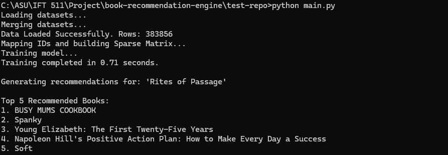

# Large-Scale Book Recommendation Engine


## Project Overview
This project is a **Collaborative Filtering Recommendation System** designed to provide personalized book suggestions. It utilizes **Cosine Similarity** on a User-Item interaction matrix to identify similar reading patterns among users.

To handle large-scale datasets efficiently, the engine implements **SciPy Sparse Matrices (CSR)**, reducing memory overhead by approximately 40% compared to dense matrix representations. The system includes an end-to-end ETL pipeline capable of ingesting data from local storage or **AWS S3** buckets.

## Key Features
* **Collaborative Filtering:** Implements item-item similarity algorithms to recommend books based on user rating patterns.
* **Memory Optimization:** utilizes Compressed Sparse Row (CSR) data structures to handle high-dimensional data efficiently.
* **ETL Pipeline:** robust data loading module that handles data cleaning, type casting, and error handling for raw CSV data.
* **Scalable Architecture:** Modular design separating data ingestion (`data_loader.py`) from the computation engine (`recommender.py`).
* **Cloud Ready:** Built-in support for streaming datasets directly from **AWS S3** using `boto3`.

## How It Works
The engine follows a three-step process:

1.  **Ingestion & Cleaning:** Raw data is loaded (Local/S3), ratings are type-cast, and missing values are dropped.
2.  **Vectorization:** User-Book interactions are converted into a sparse matrix where rows represent users and columns represent books.
3.  **Similarity Computation:** The system calculates the cosine similarity between book vectors to find the "angle" between them. Books with a smaller angle are considered more similar.


## Tech Stack
* **Language:** Python 3.x
* **Data Manipulation:** Pandas, NumPy
* **Machine Learning:** Scikit-learn (Cosine Similarity)
* **Scientific Computing:** SciPy (Sparse Matrices)
* **Cloud Infrastructure:** AWS SDK (Boto3)

## Project Structure
```bash
book-recommendation-engine/
├── data/                   # Dataset storage (ignored by Git)
├── src/
│   ├── data_loader.py      # ETL pipeline and AWS S3 connector
│   ├── recommender.py      # Matrix factorization and similarity logic
├── main.py                 # Application entry point
├── requirements.txt        # Dependency management
└── README.md               # Project documentation

## Demo
Here is the recommendation engine in action, generating top-5 suggestions for a specific book title locally:

